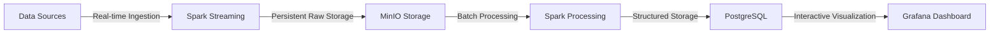

# Climate Analytics Platform


### Project Objective
This project aims to design and implement an end-to-end data engineering pipeline for comprehensive analysis of global climate change patterns using containerized distributed systems.

### Team
*   **João Antunes** (2021220964)
*   **Gabriel Pinto** (2021220925)
*   **José Cunha** (2021223719)

### Course
**Advanced Infrastructures for Data Science (IACD)** - MIACD 2025/2026
University of Coimbra

---

## 🏛️ Architecture

The platform is built around a Lambda-like architecture, separating real-time and batch processing.



### Data Flow Explanation

*   **Data Sources → Spark Streaming:** Real-time ingestion of climate data from NASA and Global Carbon Project sources.
*   **Spark Streaming → MinIO Storage:** Raw data is persistently stored in object storage for reliability and reprocessing capability.
*   **MinIO Storage → Spark Processing:** Batch processing loads data for analytical transformations.
*   **Spark Processing → PostgreSQL:** Processed results and aggregated metrics are stored in a structured format for efficient querying.
*   **PostgreSQL → Grafana Dashboard:** Final visualization layer queries the database to display interactive climate analytics.

---

## 🚀 Getting Started

### Prerequisites

Ensure you have the following software installed on your system:

*   **Docker** (with Kubernetes enabled)
*   **Git**
*   **Python** (3.9 or higher)
*   **kubectl**

### Installation

This project includes detailed, step-by-step setup guides for different operating systems. Please follow the guide that matches your environment.

*   ➡️ **For Windows users:** See [**docs/SETUP_WINDOWS.md**](./docs/SETUP_WINDOWS.md)
*   ➡️ **For Linux users:** See [**docs/SETUP_LINUX.md**](./docs/SETUP_LINUX.md)

The setup guides will walk you through installing dependencies, building the application image, and deploying the entire infrastructure on Kubernetes.

---

## ⚙️ How to Run

The primary method for running this project is via the Kubernetes manifests as described in the setup guides.

### Alternative: Docker Compose (for local development)

For a simpler, non-Kubernetes local setup, you can use the provided `docker-compose.yml` file. This is ideal for development and testing individual services.

```bash
# Start all services (Spark, MinIO, PostgreSQL, Grafana) in the background
docker-compose up -d

# To stop all services
docker-compose down
```
**Note:** When using Docker Compose, you will need to manually submit the Spark jobs using `docker exec` and run the MinIO initialization script. The Kubernetes setup automates most of these steps.

---

## 📂 Project Structure

```
.
├── data/                  # Raw data files (not checked into git)
├── docs/                  # Setup and installation guides
│   ├── SETUP_LINUX.md
│   └── SETUP_WINDOWS.md
├── jars/                  # JAR dependencies for Spark (e.g., S3, Postgres drivers)
├── k8s/                   # Kubernetes deployment manifests
│   └── deployment.yml
├── src/
│   ├── ingestion/         # Scripts for initializing storage (e.g., MinIO buckets)
│   ├── jobs/              # Spark job scripts (streaming and batch)
│   └── producer/          # The Python data streaming server
├── .gitignore
├── Dockerfile.ingestion   # Dockerfile for the data producer/ingestion image
├── docker-compose.yml     # Docker Compose file for local development
├── README.md              # This file
├── requirements.txt       # Python package dependencies
```